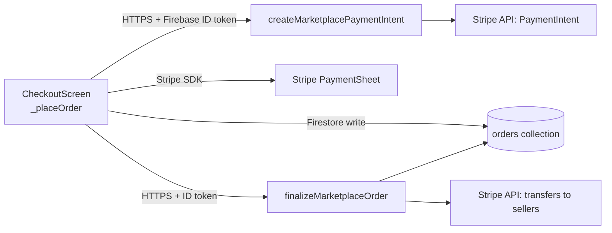
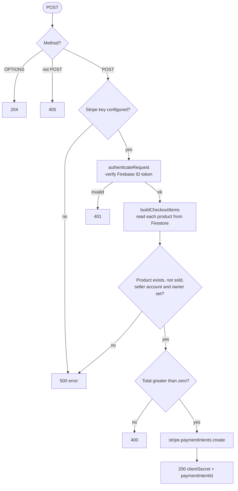
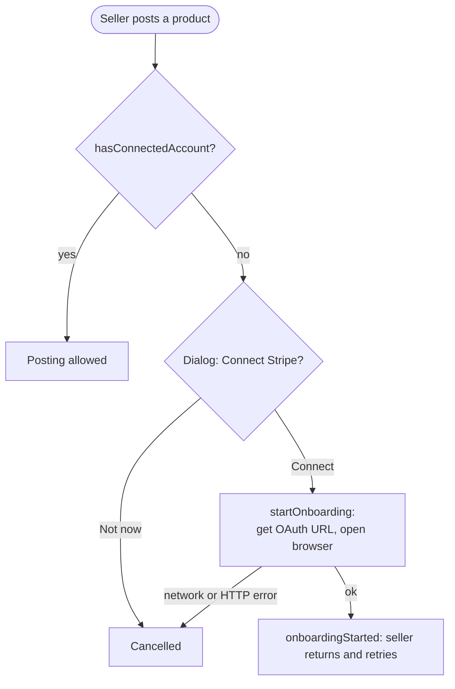

# Program Comprehension Analysis — Control Flow (Checkout and Payments)

**SWE 455 — Phase 1 · Part 1 · Tojan**

| Item | Description |
|---|---|
| **Aspect Studied** | Control flow of the checkout and payment path in SouqPlus: from pressing "Place Order" in `lib/screens/cart/checkout_screen.dart` (`_placeOrder`) to the finished order, including the Cloud Functions it calls (`createMarketplacePaymentIntent`, `finalizeMarketplaceOrder` in `functions/index.js`) and the seller Stripe onboarding check. |
| **Existing knowledge / View** | **[TOJAN: replace with what you really knew from SWE 444. Draft:]** The user adds products to the cart, presses Place Order, pays by card, and the order appears in the purchase history. I knew the screens, but not the order of the steps, which checks stop the flow, or what happens when a step fails after the payment. |
| **Analysis and Explanation** | Techniques: reading the code top-down from `_placeOrder`; following each call into the helpers and the Cloud Functions; listing every `if`, `return`, `try/catch` and `finally`; and drawing flowcharts of the result (sections 1 to 4 below). Static analysis only. The app was not run. |
| **New Knowledge Gained / View** | See the summary below, then the diagrams and tables in sections 1 to 5. |

**Summary of new knowledge**

- Checkout has 4 early exits before any money moves (empty cart, no address, not logged in, failed item validation). The server also re-checks the items and recomputes the total, so the app is not trusted for prices.
- The order is saved **after** payment success. Failures after that point (notification, mark sold, seller transfer) are only logged and cannot undo the payment.
- Seller transfers happen in a separate call (`finalizeMarketplaceOrder`) and are idempotent. If that call fails, the buyer sees success but the sellers are not paid until it is retried. Nothing in the app retries it.
- `finally` always resets the "placing order" flag, so the button never stays locked.

## Details

This section explains how control moves through the SouqPlus checkout and
payment path. The code is split between the Flutter app and Firebase Cloud
Functions.

## 1. Level 1 — who calls whom



## 2. Level 2 — control flow of `_placeOrder()` (card payment)

```mermaid
flowchart TD
    S([Press Place Order]) --> V1{Cart empty?}
    V1 -- yes --> X1[Snack: No product selected] --> END
    V1 -- no --> V2{Address or map<br/>location given?}
    V2 -- no --> X2[Snack: add address] --> END
    V2 -- yes --> L[isPlacingOrder = true]
    L --> U{User logged in?}
    U -- no --> X3[Snack: must be logged in] --> FIN
    U -- yes --> VAL{_validateCheckoutItems<br/>returns an error?}
    VAL -- yes --> X4[Snack: error message] --> FIN
    VAL -- no --> PI[createMarketplacePaymentIntent<br/>server recomputes the total]
    PI --> SHEET[Show Stripe PaymentSheet]
    SHEET --> PAY{Payment result}
    PAY -- StripeException / error --> X5[Snack: cancelled or failed] --> FIN
    PAY -- success --> SAVE[_saveOrder: orders/{id}<br/>paymentStatus = paid]
    SAVE --> NOTE[Payment confirmation notification<br/>errors logged only]
    NOTE --> SOLD[_markProductsSold<br/>FirebaseException logged only]
    SOLD --> CLEAR[Clear purchased cart items]
    CLEAR --> OK[Show order placed dialog]
    OK --> FINAL[finalizeMarketplaceOrder<br/>transfers to sellers]
    FINAL -- error --> LOG[debugPrint only]
    FINAL -- ok --> FIN
    LOG --> FIN
    SAVE -. FirebaseException .-> X6[Snack: order save failed] -.-> FIN
    FIN[isPlacingOrder = false] --> END([End])
```

### Branches and loops, step by step

| # | Decision point | True / error path | False / success path |
|---|---|---|---|
| 1 | `_cartItems.isEmpty` | Show snack and return | Continue |
| 2 | Address empty **and** no map location | Show snack and return | Continue |
| 3 | `user == null` | Show snack and return | Continue |
| 4 | `_validateCheckoutItems` returns text | Show the text and return | Continue (checks: one seller only, listing linked, seller has Stripe, not your own product) |
| 5 | `presentPaymentSheet` throws | `StripeException` or a general error: show snack and return | Continue to save the order |
| 6 | `_saveOrder` throws `FirebaseException` | Show a specific message (rules or save failed) | Continue |
| 7 | Notification, mark-sold and finalize steps throw | Error is logged and the flow continues | Continue |
| 8 | `finally` | Always sets `_isPlacingOrder = false` | — |

There is no loop in the main path. Iteration only happens inside helpers
(for example `for (item in items)` in `_validateCheckoutItems` and in the
server-side transfer allocation).

**Design note:** after step 5 the money has already been taken, so the later
failures (steps 6 and 7) cannot undo the payment. That is why they are
caught, logged and reported separately instead of aborting.

## 3. Server side — control flow of `createMarketplacePaymentIntent`



`finalizeMarketplaceOrder` follows the same guard sequence (method, key, token),
then checks that the order exists, belongs to the caller and has not already been
transferred (idempotent), retrieves the PaymentIntent and requires status
`succeeded`, splits the net amount per seller, creates one Stripe transfer per
seller (with an idempotency key), and finally marks the order `complete` and the
products `Sold`.

## 4. Seller onboarding control flow (`seller_stripe_service.dart`)



## 5. Control flow after the Tamara change (MR004)

The same `_placeOrder()` now has one extra branch right after validation:

```mermaid
flowchart TD
    VAL[Validation passed] --> PM{Payment method}
    PM -- Card --> CARD[Stripe flow from section 2]
    PM -- Tamara --> SAVE[Save order: paymentStatus = pending]
    SAVE --> CK[createTamaraCheckout]
    CK -- error --> CL[Close order as canceled, show error]
    CK -- ok --> OPEN[Open Tamara checkout in browser]
    OPEN --> WAIT[Waiting dialog + listen to orders/{id}]
    WH[(Tamara calls tamaraWebhook)] -. order_approved: authorise, mark paid .-> WAIT
    WAIT --> RES{Result}
    RES -- paid --> DONE[Notification, clear cart, success dialog]
    RES -- failed / canceled / timeout --> CL2[Close order as canceled, snack]
```
